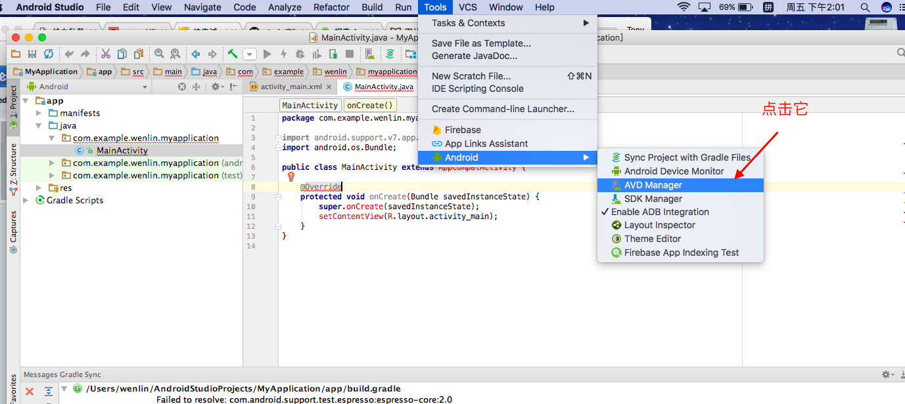
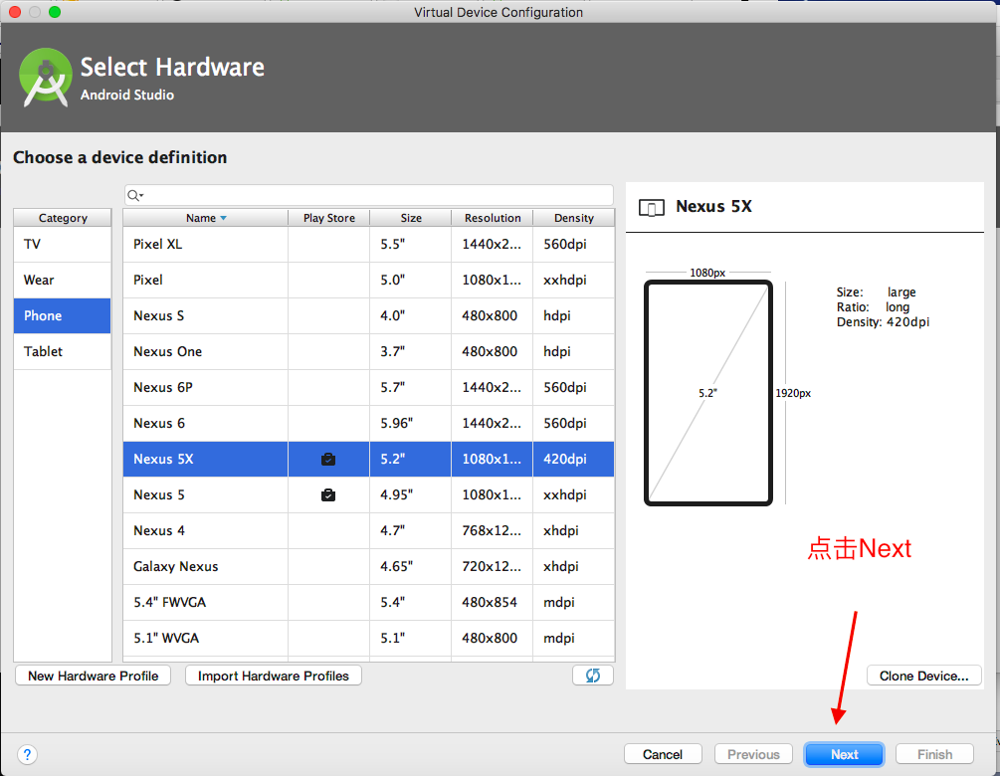
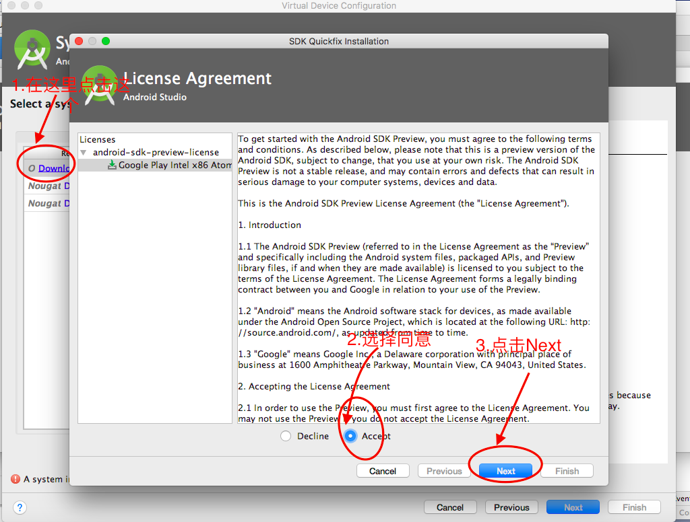
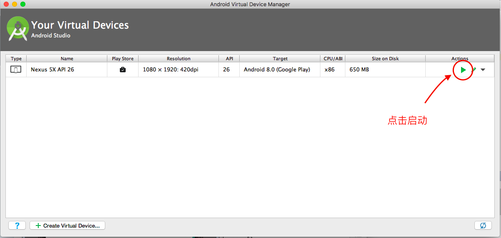
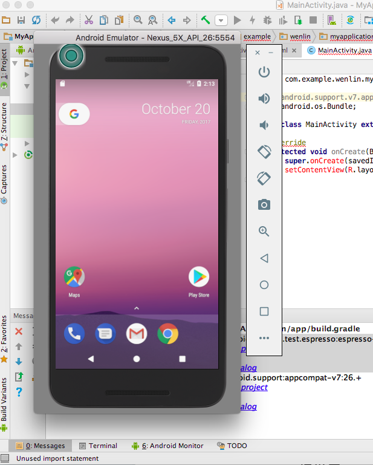

##  Mac 下，利用 Android Studio 体验 Android 8.0

1. 首先你需要到 Android Studio 官网下载它。

[Android Studio 下载地址](https://developer.android.com/studio/index.html?hl=zh-cn)

[Android Studio 安装指导](https://developer.android.com/studio/install.html?hl=zh-cn)

2. 安装完成之后，点击 Start a new Android Studio Project，你会进入下面这个地方。

一直选择默认安装，就会进入下面这个地方👇

等待它下载完成，然后点击 Finish, 到了下面这个地方。

选择默认名，然后 Next，进入这下面这个界面。

大功告成！！！🎆

[原文地址，也就是 windows 的](http://bbs.wuyou.net/forum.php?mod=viewthread&tid=397823)
