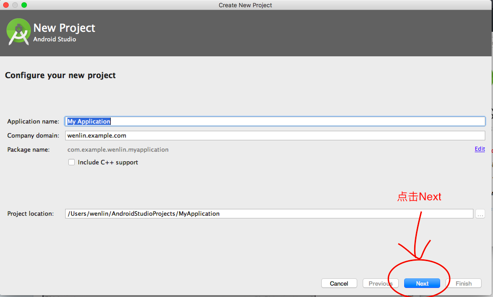
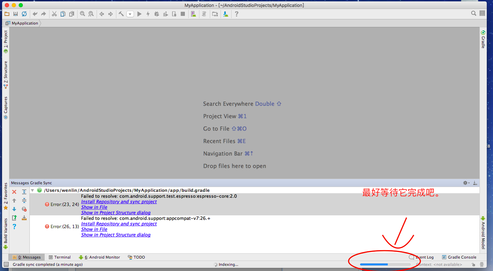

##  Mac 下，利用 Android Studio 体验 Android 8.0

1. 首先你需要到 Android Studio 官网下载它。

[Android Studio 下载地址](https://developer.android.com/studio/index.html?hl=zh-cn)

[安装 Android Studio 指导](https://developer.android.com/studio/install.html?hl=zh-cn)

2. 安装完成之后，点击 Start a new Android Studio Project，你会进入下面这个地方。

一直选择默认安装，就会进入下面这个地方👇

